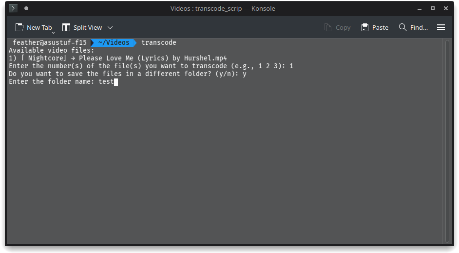

#### Transcode Video Bash Script
## Davinci Resolve in Linux has limited compatibility with AV Format recordings. This script is designed to transcode videos in .mov format.



## How it works

- It checks the user's current directory for any videos and prompts the users to select from options 1, 2, or 3.
- It asks if you want to create a new output folder or save the transcoded video in the current directory.
- If saving in the current directory, it will prompt you to rename the video to avoid conflicts.

### Youtube Tutorial - [Click Here](https://youtu.be/I0oqHkP93JM)

## How to set up

1. Clone the project.
2. Run the following command to give execute permissions to the script:

```bash
chmod +x transcode_script.sh
```

3. Add the following line as an alias in your .bashrc file:

```bash
alias transcode="~/path/to/transcode_script.sh"
```
